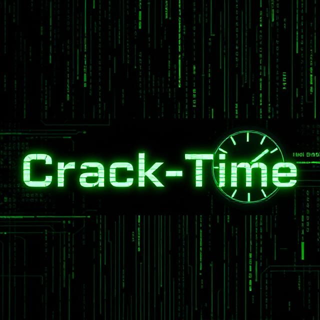

<p align="center">
  
</p>

# ⏳ Crack-Time – Password Strength & Hack Time Estimator
# ⏳ Crack-Time – Password Strength & Hack Time Estimator


---

> 🛡️ **Crack-Time** is a **password strength analyzer and hack-time estimator**.  
> It calculates how long a brute-force attacker would take to crack your password,  
> helping you create stronger, safer credentials.  
>  
> ⚠️ **For educational and security awareness purposes only.**

---

## 🔥 Features

- 🔑 **Password Strength Scoring** – Analyzes complexity and entropy
- ⏱️ **Estimated Crack Time** – Shows time to crack at different speeds
- 🖥️ **Hacker-Style UI** – Neon green ASCII banners and animations
- 💡 **Password Suggestions** – Tips to improve your password security
- 🛠️ **Cross-Platform** – Works on Windows, Linux (Kali), and Termux
- 📜 **Open Source & MIT Licensed**

---

## 🖼 Demo

██████╗ ██████╗  █████╗  ██████╗██╗  ██╗    ████████╗██╗███╗   ███╗███████╗ ██╔══██╗██╔══██╗██╔══██╗██╔════╝██║ ██╔╝    ╚══██╔══╝██║████╗ ████║██╔════╝ ██████╔╝██████╔╝███████║██║     █████╔╝        ██║   ██║██╔████╔██║█████╗
██╔═══╝ ██╔═══╝ ██╔══██║██║     ██╔═██╗        ██║   ██║██║╚██╔╝██║██╔══╝
██║     ██║     ██║  ██║╚██████╗██║  ██╗       ██║   ██║██║ ╚═╝ ██║███████╗ ╚═╝     ╚═╝     ╚═╝  ╚═╝ ╚═════╝╚═╝  ╚═╝       ╚═╝   ╚═╝╚═╝     ╚═╝╚══════╝

---

## 📂 Project Structure

```text
Crack-Time/
├── BruteMeter.py           # Main script
├── utils/
│   ├── ui.py               # ASCII UI & colors
│   ├── calculator.py       # Password strength logic
│   └── suggestions.py      # Security tips generator
├── sample_passwords.txt    # Example weak passwords
├── README.md
├── LICENSE
└── .gitignore


---

⚙️ Installation & Usage

🔹 Windows

# Install Python 3 from https://python.org
# Install Git from https://git-scm.com

git clone https://github.com/YourUsername/Crack-Time.git
cd Crack-Time

pip install colorama tqdm
python BruteMeter.py


---

🔹 Kali Linux / Any Linux Distro

sudo apt update && sudo apt upgrade -y
sudo apt install python3 python3-pip git -y

git clone https://github.com/YourUsername/Crack-Time.git
cd Crack-Time

pip3 install colorama tqdm
python3 BruteMeter.py


---

🔹 Termux (Android)

pkg update && pkg upgrade -y
pkg install python git -y

git clone https://github.com/YourUsername/Crack-Time.git
cd Crack-Time

pip install colorama tqdm
python BruteMeter.py


---

🛠️ How It Works

1. Enter your password in the prompt.


2. Crack-Time calculates its complexity:

Character set size (lowercase, uppercase, digits, symbols)

Password length

Estimated entropy


3. It estimates time to crack at different speeds:

🐢 1,000 guesses/sec

⚡ 1M guesses/sec

🚀 1B+ guesses/sec


4. Displays strength rating (Weak → Military Grade).


5. Gives tips to strengthen your password.


---

🛣️ Roadmap

[x] Base password analyzer

[x] Crack time estimation

[x] Fancy terminal UI

[ ] Add hash-cracking simulation

[ ] Support for multiple languages

[ ] Docker image for easy deployment


---

🧾 License

This project is licensed under the MIT License.
See the LICENSE file for details.


---

⚠️ Disclaimer

This project is for educational purposes and security awareness only.
Using Crack-Time for malicious activities is strictly prohibited.
Always test only on passwords and systems you own.


---

👨‍💻 Credits

Author: Dhyan Ajay

Inspiration: Open-source security community

Special Thanks: Python community & ethical hackers worldwide 🌍


---

⭐ Contribute & Support

Star ⭐ this repo if you like it!

Submit pull requests with enhancements

Share it to spread security awareness


---
